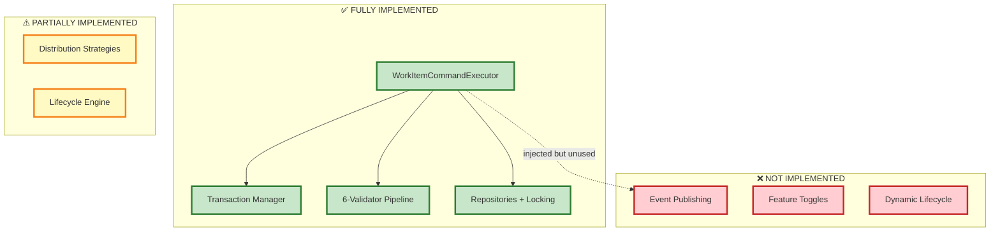
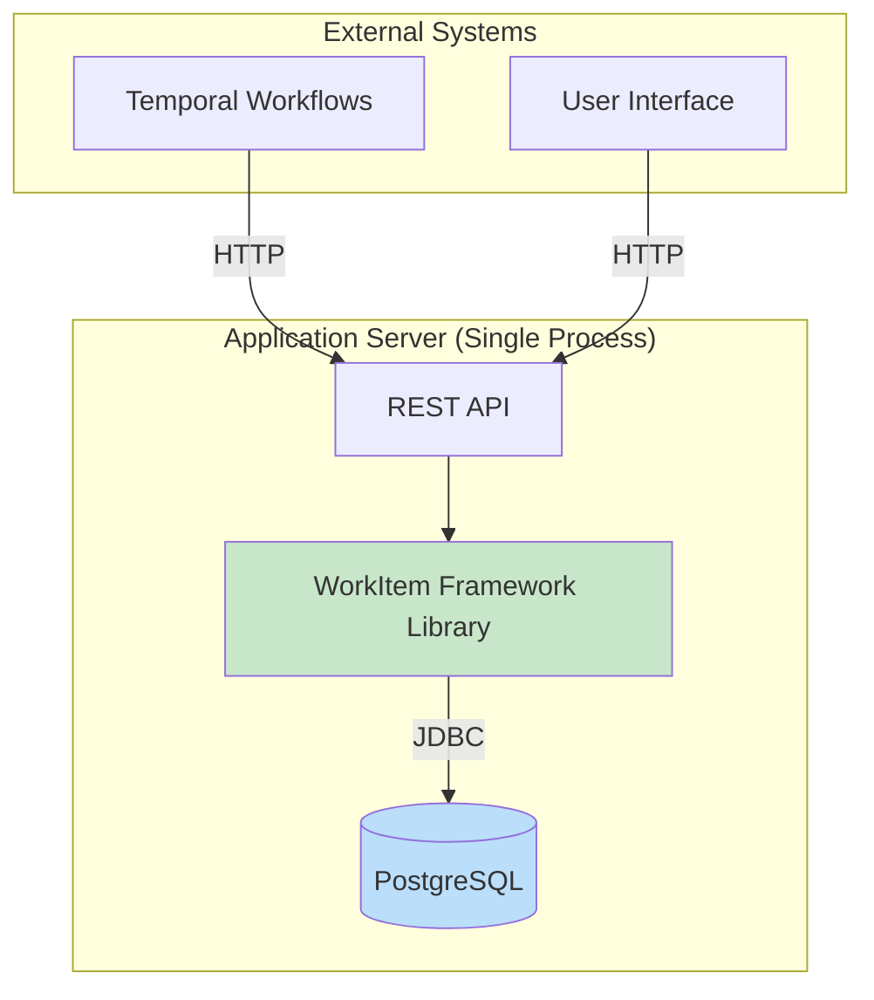

# WorkItem Framework - Architecture Document (CORRECTED)
## Implementation Reality vs Design Intent

### Document Information
- **Version**: 2.0 (Corrected)
- **Last Updated**: January 2026
- **Purpose**: Honest assessment of actual implementation

---

## 1. Executive Summary

### 1.1 What This Framework ACTUALLY Is
The WorkItem Framework is a **single-process, transaction-safe library** for managing human task lifecycles. It is:
- ✅ **Monolithic Library** (not microservices)
- ✅ **Synchronous** (not event-driven, despite design goals)
- ✅ **Transaction-First** (ACID guarantees via PostgreSQL)
- ✅ **Modular** (good package structure, clean architecture)

### 1.2 Core Value Proposition
**What it does VERY WELL**:
- Atomic, transactional task management
- Optimistic locking for concurrency
- Comprehensive validation pipeline
- Clean separation of concerns

**What it does NOT do** (despite design docs claiming otherwise):
- ❌ Event-driven integration (code commented out)
- ❌ Microservices (single process, shared transaction)
- ❌ Dynamic feature toggles (no configuration system)
- ❌ Pluggable strategies (only one registered)

---

## 2. Actual vs Intended Architecture

### 2.1 Design Intent (From Docs)
The design documents describe:
- "Microservice-oriented framework"
- "Event-driven or synchronous integration (configurable)"
- "Configurable features ON/OFF"
- "Optional Event Bus"

### 2.2 Implementation Reality (From Code)



---

## 3. Feature Implementation Status

| Feature | Status | Evidence | Impact |
|:--------|:-------|:---------|:-------|
| **Transaction Safety** | ✅ **IMPLEMENTED** | `JdbcPersistenceUnitOfWork.withTransaction()` | Works perfectly |
| **Optimistic Locking** | ✅ **IMPLEMENTED** | `version` column, `ConcurrentModificationError` | Works perfectly |
| **Validation Pipeline** | ✅ **IMPLEMENTED** | 6 validators in `WorkItemCommandValidationService` | Works perfectly |
| **Basic Distribution** | ✅ **IMPLEMENTED** | `OFFER_TO_ALL` strategy registered | Works for simple cases |
| **Audit Logging** | ✅ **IMPLEMENTED** | `work_item_audit` table populated | Works perfectly |
| **Push/Pull Modes** | ✅ **IMPLEMENTED** | `OfferResolver` handles both | Works perfectly |
| | | | |
| **Advanced Strategies** | ⚠️ **PARTIAL** | Files exist (`RoundRobin`, `Random`, `LoadBased`) but **NOT REGISTERED** | Dead code |
| **Idempotency** | ⚠️ **PARTIAL** | `JdbcIdempotencyRepository` exists but **NOT CALLED** | No protection |
| **Lifecycle Config** | ⚠️ **PARTIAL** | Hardcoded in `DefaultTransitionResolver` | Not extensible |
| | | | |
| **Event Publishing** | ❌ **NOT IMPLEMENTED** | All `outboxRepo.insert()` calls **COMMENTED OUT** | No async integration |
| **Event Subscribing** | ❌ **NOT IMPLEMENTED** | No consumer code exists | No async integration |
| **Feature Toggles** | ❌ **NOT IMPLEMENTED** | No config file, no toggle service | No runtime control |
| **Microservices** | ❌ **NOT IMPLEMENTED** | Single process, single DB transaction | Monolithic |

---

## 4. Why This is NOT (and Should NOT be) Microservices

### 4.1 Current Architecture: Monolithic Library

**Transaction Boundary**:
```typescript
// WorkItemCommandExecutor.execute()
return this.uow.withTransaction(async (tx) => {
  // 1. Validate (Command Service + 6 Validators)
  // 2. Resolve Assignment (Org Model lookups)
  // 3. Persist WorkItem
  // 4. Persist Participants
  // 5. Persist Audit Log
  // ALL IN ONE TRANSACTION
});
```

**Why This Matters**:
- Everything happens **atomically**
- Either ALL succeed or ALL rollback
- **Zero data inconsistency**

### 4.2 Could It Be Microservices?

**Theoretical Split**:
```
Service 1: WorkItem Management
Service 2: Org Model / User Resolution
Service 3: Audit Service
```

**Problems**:

| Problem | Impact | Solution Complexity |
|:--------|:-------|:-------------------|
| **Distributed Transactions** | Need 2-Phase Commit or Saga pattern | HIGH - violates "single transaction" principle |
| **Network Latency** | 3+ service calls per operation | Breaks "sub-second" performance goal |
| **Data Consistency** | Eventual consistency, not ACID | Breaks audit integrity guarantee |
| **Complexity** | Need service mesh, circuit breakers, retry logic | 10x operational overhead |

### 4.3 My Assessment: **NO, It Should NOT Be Microservices**

**Reasons**:

1. **Core Value = Transactional Integrity**
   - The framework's PRIMARY value is "WorkItem + Audit + Participants in ONE atomic unit"
   - Microservices would DESTROY this guarantee

2. **Wrong Bounded Context**
   - There are no natural service boundaries
   - "Org Model" is a **lookup table**, not a separate domain
   - "Audit" is a **side effect**, not a separate service

3. **Performance Goals Conflict**
   - Design doc: "Sub-second WorkItem create/complete"
   - Microservices: 3× network hops = 100-300ms overhead minimum

4. **No Independent Scaling Needs**
   - WorkItem creation rate = Audit log rate = Participant update rate
   - They scale together, not independently

### 4.4 What "Microservice-Oriented" ACTUALLY Means

The design doc likely meant:
- ✅ **Modular design** (clean package boundaries) → **ACHIEVED**
- ✅ **Deployment flexibility** (could be packaged as service) → **ACHIEVED**
- ✅ **API-first** (consumed via Gateway, not direct DB access) → **ACHIEVED**
- ❌ **Separate runtime processes** → **NOT NEEDED**

---

## 5. What IS Well-Architected

### 5.1 Clean Architecture ✅
**Evidence**:
```
packages/
  domain/           ← Business logic, NO dependencies on infrastructure
  persistence/      ← Infrastructure, depends on domain
  gateway/          ← External interface
```

**Benefit**: Could swap PostgreSQL for MySQL/MongoDB without touching domain logic

### 5.2 CQRS-Lite ✅
**Separation**:
- `WorkItemCommandService`: **Decision** (pure logic, no I/O)
- `WorkItemCommandExecutor`: **Execution** (orchestration, persistence)

**Benefit**: Easy to test business rules without database

### 5.3 Transaction Safety ✅
**Pattern**: Unit of Work with automatic rollback
```typescript
try {
  BEGIN
  // ... operations
  COMMIT
} catch {
  ROLLBACK
  throw
}
```

**Benefit**: Impossible to create orphaned WorkItems without audit logs

---

## 6. Corrected Recommendations

### 6.1 DO NOT Attempt (Would Harm the Framework)
❌ Split into microservices  
❌ Add eventual consistency  
❌ Remove transaction boundaries for "performance"

### 6.2 DO Complete Partial Features
✅ **P0: Wire Idempotency**
```typescript
// In WorkItemCommandExecutor.execute()
const key = `${command.workflowId}-${command.action}-${Date.now()}`;
if (!await idempotencyRepo.tryInsert(tx, key)) {
  return CommandDecision.duplicate();
}
```

✅ **P1: Register All Strategies**
```typescript
// In DistributionStrategyRegistry initialization
strategyRegistry.register(new OfferToAllStrategy());
strategyRegistry.register(new RoundRobinStrategy());
strategyRegistry.register(new RandomStrategy());
strategyRegistry.register(new LoadBasedStrategy());
```

✅ **P2: Externalize Lifecycle**
- Move hardcoded map to configuration file/database
- Allow custom lifecycles without code changes

### 6.3 DO Consider (If Async Needed)
✅ **Enable Event Publishing** (for downstream consumers)
- Uncomment `outboxRepo.insert()` calls
- Add background worker to poll outbox table
- Publish events to message bus (Kafka/RabbitMQ)

**Pattern**: Transactional Outbox
```
BEGIN TRANSACTION
  1. Update WorkItem
  2. Insert Audit
  3. Insert Outbox Event  ← Within same TX
COMMIT

Separate Process:
  - Poll outbox table
  - Publish to message bus
  - Mark as published
```

**Benefit**: Guaranteed event delivery WITHOUT distributed transactions

---

## 7. Honest Assessment

### 7.1 What This Framework Excels At
1. **Transactional Integrity**: Best-in-class
2. **Concurrency Safety**: Optimistic locking works
3. **Code Quality**: Clean architecture, good separation
4. **Validation**: Comprehensive 6-validator pipeline

### 7.2 What Needs Work
1. **Partial Features**: Many half-implemented (idempotency, strategies)
2. **Configuration**: Hardcoded values, no external config
3. **Async Integration**: Designed but disabled
4. **Documentation Alignment**: Design docs over-promise

### 7.3 Is It Production-Ready?
**For synchronous, single-database workloads**: ✅ **YES** (with idempotency fix)  
**For event-driven, distributed systems**: ❌ **NO** (events not enabled)

---

## 8. Deployment Architecture (Realistic)

### Current Best Practice:



**Scaling Strategy**:
- Horizontal: Multiple app servers, shared database
- Vertical: Scale PostgreSQL (connection pooling)
- NOT: Microservices decomposition

---

## 9. Conclusion

The WorkItem Framework is a **well-designed, monolithic library** that prioritizes **transactional integrity** over distributed scalability. The design documents' mention of "microservices" and "event-driven" were **aspirational goals**, not actual implementations.

**Should you "fix" this?** **NO.** The monolithic, transaction-focused design is **correct for the use case**. Complete the partial features, but do NOT attempt microservices decomposition—it would destroy the framework's core value.

**Key Insight**: Sometimes "monolithic" is the **RIGHT** architecture. This is one of those cases.
