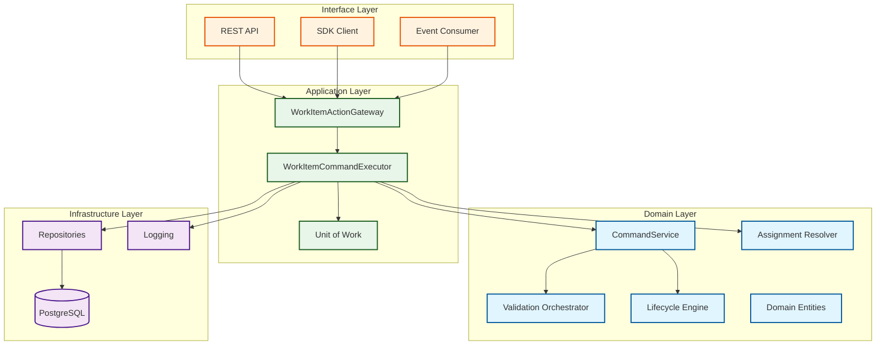
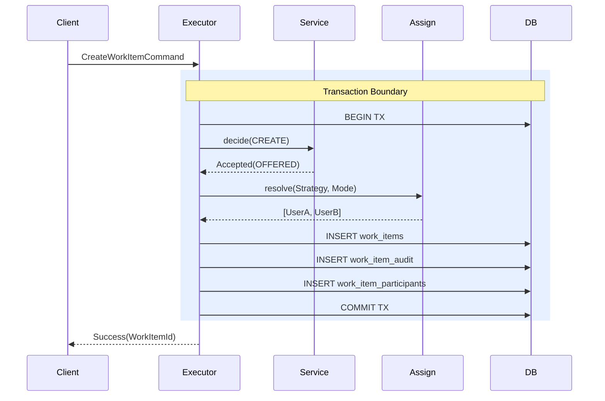
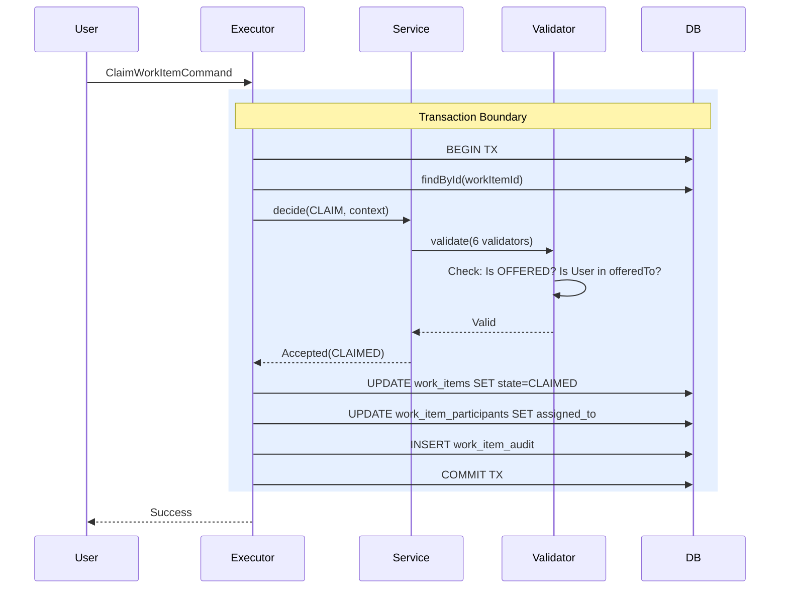
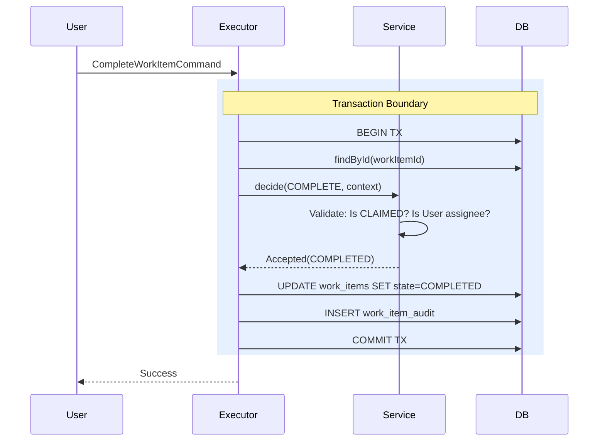
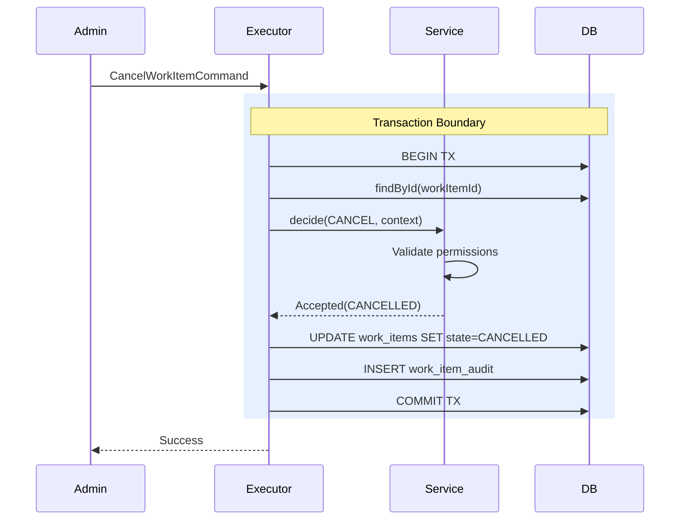

# WorkItem Framework - Architecture & Design Document

## Document Information
- **Version**: 1.0
- **Last Updated**: January 2026
- **Document Type**: Technical Architecture & Design Specification

---

## 1. Executive Summary

### 1.1 Purpose
The **WorkItem Framework** is a lightweight, microservice-oriented execution engine for managing human task lifecycles in workflow-driven applications. It provides:
- **Human Task Management**: Create, assign, claim, complete, and cancel work items
- **Advanced Distribution**: Multiple strategies for user assignment (Round-Robin, Load-Based, Random, etc.)
- **Auditability**: Complete audit trail of all state transitions
- **Integration Flexibility**: SDK and REST API access with optional event-driven capabilities

### 1.2 Scope

**In Scope**:
- WorkItem lifecycle orchestration (State management)
- User and organizational model resolution
- Assignment distribution strategies
- Transaction-safe persistence
- Audit logging
- Event-driven integration (optional)

**Explicitly Out of Scope**:
- Workflow modeling or BPM execution engine
- User interface components
- Hard dependency on specific orchestrators (Temporal-agnostic)
- Multi-tenancy

---

## 2. Architecture Principles

The framework is built on the following architectural principles:

| Principle | Description | Benefit |
|:----------|:------------|:--------|
| **Clean Architecture** | Strict separation of Domain (business logic), Application (orchestration), and Infrastructure (persistence) layers | Testability, maintainability, independence from frameworks |
| **CQRS-Lite** | Separation of Command (Write) from Decision logic | Clear responsibility boundaries, easier validation |
| **Single Tenant** | One logical client per deployment, no tenant isolation | Simplified queries, performance optimization |
| **Strategy Pattern** | Pluggable distribution and lifecycle strategies | Extensibility without core logic changes |
| **Transaction-First** | All operations within explicit transaction boundaries | Data consistency, atomic operations |
| **Event-Driven Capable** | Optional event publishing via Outbox pattern | Loose coupling, asynchronous integration |
| **Performance-First** | Sub-second operations, no polling, single transaction per operation | Scalability, responsiveness |

---

## 3. High-Level Architecture

### 3.1 Architectural Layers



### 3.2 Component Catalog

| Component | Layer | Role | Key Responsibilities |
|:----------|:------|:-----|:---------------------|
| `WorkItemActionGateway` | Interface | Port/API | External entry point, defines public contract |
| `WorkItemCommandExecutor` | Application | Orchestrator | Transaction management, sequence coordination |
| `WorkItemCommandService` | Domain | Decision Engine | Validation, state machine enforcement |
| `ValidationOrchestrator` | Domain | Validation Pipeline | Coordinates 6 validators (Lifecycle, Auth, Assignment, Parameter, Idempotency, State) |
| `LifecycleEngine` | Domain | State Machine | Valid state transitions, initial state resolution |
| `AssignmentResolver` | Domain | Distribution | Strategy execution, candidate selection |
| `OfferResolver` | Domain | Push/Pull Logic | Determines assignment vs offering |
| `JdbcPersistenceUnitOfWork` | Infrastructure | Transaction Manager | BEGIN/COMMIT/ROLLBACK, error recovery |
| `Repositories` | Infrastructure | Data Access | CRUD, optimistic locking, SQL execution |

---

## 4. Core Features

### 4.1 WorkItem Lifecycle Management
- **Configurable State Machine**: Default (NEW → OFFERED → CLAIMED → COMPLETED/CANCELLED), extensible
- **State Validation**: Enforced via `LifecycleEngine` and `TransitionResolver`
- **Audit Trail**: Every state change logged with actor, timestamp, context

### 4.2 Distribution Strategies
Available strategies (some require explicit registration):

| Strategy | Mode | Description | Use Case |
|:---------|:-----|:------------|:---------|
| `OFFER_TO_ALL` | Pull | Default, broadcasts to all candidates | Democratic selection |
| `ROUND_ROBIN` | Push | Cycles sequentially through users | Fair distribution |
| `RANDOM` | Push | Random selection | Load testing, sampling |
| `LOAD_BASED` | Push | Assigns to least-loaded user | Capacity balancing |
| `SEPARATION_OF_DUTIES` | Both | Prevents self-approval (creator ≠ approver) | Compliance |

### 4.3 Assignment Modes
- **PUSH**: Framework assigns specific user immediately (`assignedTo` set, state → `CLAIMED`)
- **PULL**: Framework offers to pool (`offeredTo` list populated, state → `OFFERED`, user must claim)

### 4.4 Validation Framework
Six-validator pipeline in `WorkItemCommandValidationService`:

1. **Lifecycle Validator**: Ensures transition is valid (e.g., OFFERED → CLAIMED)
2. **State Transition Validator**: Validates source/target state combination
3. **Authorization Validator**: Verifies actor has permission for action
4. **Assignment Eligibility Validator**: Confirms user is in `offeredTo` list (for claims)
5. **Parameter Validator**: Validates input/output parameters against schema
6. **Idempotency Validator**: Checks for duplicate command execution

### 4.5 Organizational Model
Comprehensive model supporting enterprise patterns:
- **OrgUnits**: Hierarchical departments
- **Positions**: Roles within org units
- **Groups**: Logical user collections
- **Capabilities**: Skills/eligibility for assignment criteria
- **Privileges**: Authorization model for access control

---

## 5. Reliability & Safety

### 5.1 Transaction Management
**Mechanism**: `JdbcPersistenceUnitOfWork` wraps all operations in database transactions.

```typescript
async withTransaction<T>(fn: (tx: TransactionContext) => Promise<T>): Promise<T> {
  // BEGIN transaction
  try {
    const result = await fn(tx);
    // COMMIT on success
    return result;
  } catch (err) {
    // ROLLBACK on any error
    throw err;
  }
}
```

**Guarantees**:
- **Atomicity**: WorkItem + Audit + Participants persist together or not at all
- **Consistency**: No partial updates in the database
- **Isolation**: Transaction-level isolation (configurable at DB level)

### 5.2 Concurrency Control
**Mechanism**: Optimistic Locking via `version` column

```sql
UPDATE work_items 
SET state = $1, version = version + 1 
WHERE id = $2 AND version = $3
```

**Behavior**:
- Parallel updates to same WorkItem detected via version mismatch
- Throws `ConcurrentModificationError` on conflict
- Client must retry with fresh version

### 5.3 Idempotency (⚠️ Gap Identified)
**Architecture**: `JdbcIdempotencyRepository` exists with unique key constraints

**Current State**: NOT wired into `WorkItemCommandExecutor`

**Risk**: Duplicate command execution possible on retries

**Recommendation**: Add `idempotencyRepo.tryInsert(commandId)` at start of `execute()`

### 5.4 Exception Handling
**Typed Error Hierarchy**:

```
Error
├── DomainError (business logic violations)
│   ├── InvalidWorkItemTransitionError
│   └── WorkItemNotFoundError
└── PersistenceError (infrastructure failures)
    ├── DuplicateKeyError
    ├── ConcurrentModificationError
    ├── InvalidReferenceError
    └── PersistenceUnavailableError
```

**Handling Strategy**:
- Domain errors: Return `CommandDecision.rejected()` with reason
- Persistence errors: Trigger transaction ROLLBACK, propagate to client
- Mapped via `mapPgError()` for PostgreSQL-specific codes

### 5.5 Logging
**Interface**: 5-level structured logging (`Logger` interface)
- `trace`: Low-level debugging
- `debug`: Detailed execution flow
- `info`: Key operations (Create, Claim, Complete)
- `warn`: Validation failures, recoverable issues
- `error`: Exceptions, rollbacks, critical failures

**Implementation**: Interface-based, inject concrete logger (console, file, ELK, etc.)

---

## 6. Detailed Workflows

### 6.1 Create WorkItem



**Steps**:
1. **Transaction Start**: `UOW.withTransaction()`
2. **Decision**: Service validates and returns initial state
3. **Resolution**: AssignmentResolver applies strategy, OfferResolver determines Push/Pull
4. **Persistence**: Repository saves WorkItem, Participants, Audit
5. **Commit**: Transaction completes atomically

### 6.2 Claim WorkItem



**Special Handling**: Updates `work_item_participants` table to track assignment

### 6.3 Complete WorkItem



### 6.4 Cancel WorkItem



---

## 7. Configurable Features

### 7.1 Feature Toggles (Design-Time)
From original design specification:

| Feature | Default | Description |
|:--------|:--------|:------------|
| Event Publishing | OFF | Emit events to message bus after state changes |
| Event Subscribing | OFF | Consume external events as commands |
| Distribution Strategies | Configurable | Enable/disable specific strategies |
| Push Mode | ON | Allow immediate assignment |
| Pull Mode | ON | Allow offer-and-claim pattern |
| Escalation/SLA | OFF | Time-based automatic reassignment |

### 7.2 Distribution Configuration
Via `DistributionStrategyRegistry`:
- **Registration**: Strategies must be registered to be available
- **Fallback**: If requested strategy unavailable, falls back to DEFAULT
- **Runtime Selection**: Command specifies `distributionStrategy` parameter

---

## 8. Missing or Incomplete Elements

### 8.1 Identified Gaps

| Gap | Impact | Current State |
|:----|:-------|:--------------|
| **Idempotency Wiring** | HIGH | Repository exists but not invoked in Executor |
| **Strategy Registration** | MEDIUM | Random, RoundRobin, LoadBased not registered by default |
| **Configuration Externalization** | MEDIUM | Lifecycle map hardcoded in `DefaultTransitionResolver` |
| **Outbox Publishing** | LOW | Code commented out in Executor |
| **Parameter Schema Validation** | MEDIUM | Schema resolution marked as "Phase 3" |
| **Feature Toggle Configuration** | HIGH | No central configuration file or service |

### 8.2 Unused Components
From previous analysis:
- `JdbcIdempotencyRepository`: Implemented but not called
- `JdbcOrgModelRepository`: Exists but not integrated
- Distribution strategies: Implemented but not all registered
- Command Handlers: Exist but unused (Executor handles all logic)

---

## 9. Recommendations

### 9.1 Critical (P0)
1. **Wire Idempotency**: Add `idempotencyRepo.tryInsert(key)` in `WorkItemCommandExecutor.execute()`
2. **Create Feature Toggle Config**: Implement central configuration service/file
3. **Register All Strategies**: Auto-register strategies on application startup

### 9.2 High Priority (P1)
4. **Externalize Lifecycle Definitions**: Move from hardcoded map to database/config file
5. **Complete Parameter Validation**: Implement schema resolution and validation
6. **Add Integration Tests**: Verify end-to-end workflows with concurrent access

### 9.3 Medium Priority (P2)
7. **Enable Outbox Pattern**: Uncomment and test event publishing
8. **Document API Contracts**: Generate OpenAPI/Swagger specs
9. **Performance Benchmarking**: Establish baseline metrics for create/complete operations

### 9.4 Technical Debt
10. **Remove Unused Code**: Delete unused handlers or integrate them properly
11. **Consistent Error Handling**: Ensure all errors extend typed hierarchy
12. **Logging Standardization**: Remove console.log, use Logger interface consistently

---

## 10. Conclusion

The WorkItem Framework demonstrates solid architectural foundations with clear separation of concerns, transaction safety, and extensibility through strategy patterns. The primary focus should be on closing the identified gaps (idempotency, configuration management) and completing the partially implemented features (parameter validation, event publishing) to achieve production readiness.

### Key Strengths
✅ Clean Architecture with well-defined layer boundaries  
✅ Transaction-safe operations with optimistic locking  
✅ Comprehensive validation framework  
✅ Extensible distribution strategies  
✅ Complete audit trail

### Key Areas for Improvement
⚠️ Idempotency not enforced  
⚠️ Feature toggles not centrally managed  
⚠️ Some strategies not activated  
⚠️ Configuration hardcoded in several areas
